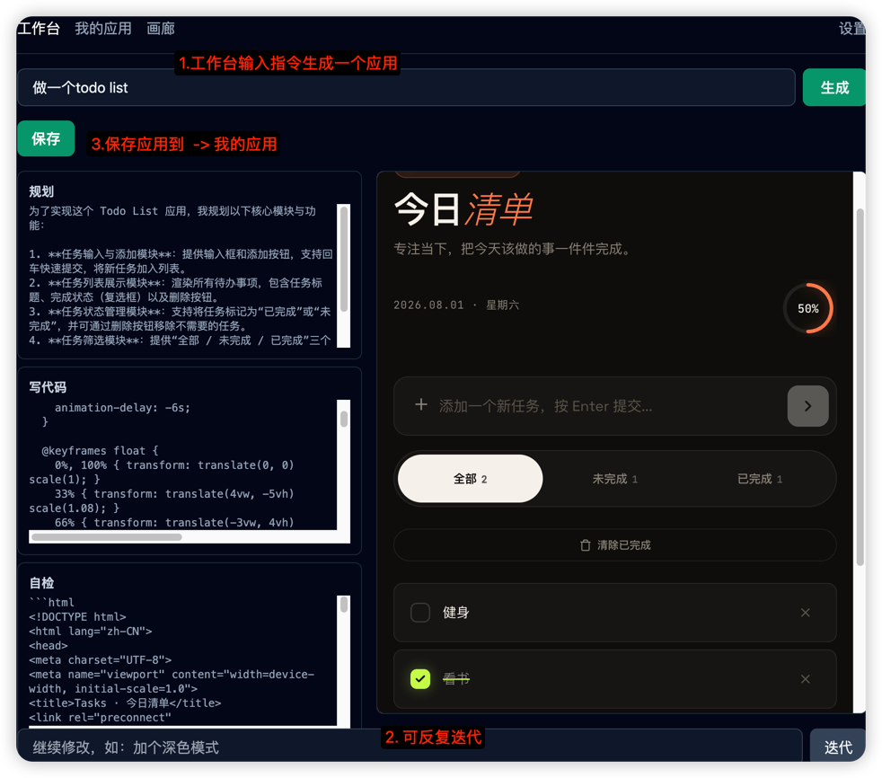
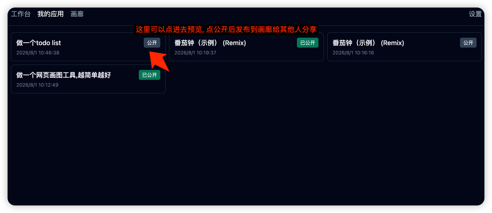
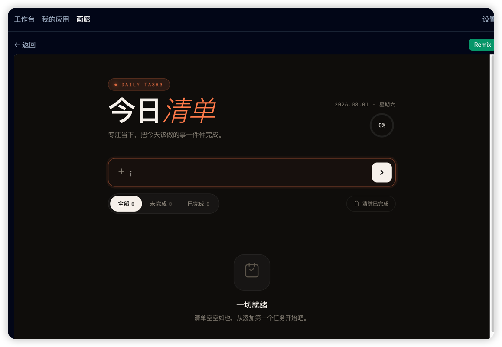
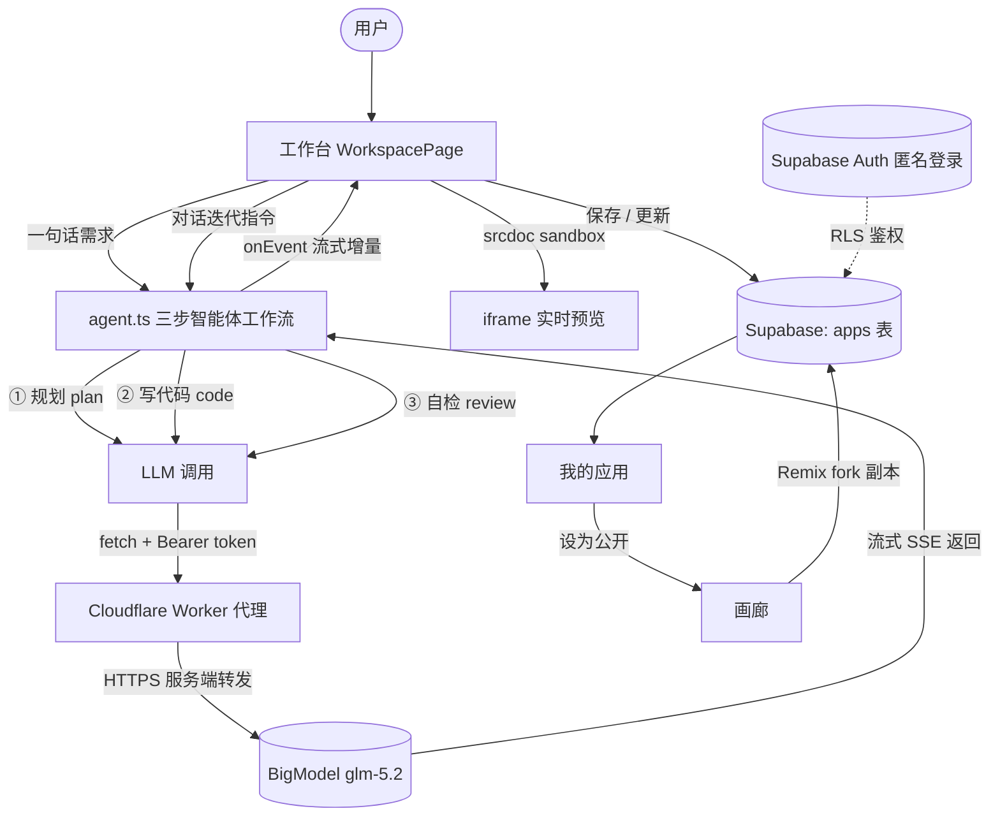

# Atoms-Demo

> AI 智能体驱动、一句话生成可运行网页应用的 Demo（ROOT 全栈岗位笔试项目）。

**在线体验：** https://txjjjjj.github.io/atoms-demo/ ｜ **源码：** https://github.com/txjjjjj/atoms-demo

用户用一句话描述需求（如「做一个番茄钟」），系统通过一个**三步智能体工作流**（规划 → 写代码 → 自检修订）流式生成一份自包含的 HTML 应用，并在沙盒 iframe 中实时预览。用户可继续用自然语言对话迭代（如「加深色模式」），满意后保存到云端，或公开到画廊供他人 Remix。

## 功能特性

### 1. 工作台 —— 一句话生成应用

输入需求 → 智能体三步工作流（规划 / 写代码 / 自检）流式可见 → 沙盒 iframe 实时预览可交互应用。



### 2. 我的应用 —— 保存与公开

生成满意后保存到云端（Supabase），在「我的应用」中管理，可切换公开 / 私有。



### 3. 画廊 —— 浏览与 Remix

公开应用进入画廊，任何人可点开运行，或一键 **Remix**（fork 到自己账号继续改造）。



### 核心能力一览

- **BYO Key**：在「设置」页粘贴 BigModel token，存于浏览器 localStorage，无需服务端密钥。
- **三步智能体工作流**：规划（plan）→ 写代码（code）→ 自检修订（review），每一步流式输出到独立面板，过程可见。
- **iframe 实时预览**：通过 `srcdoc` + `sandbox="allow-scripts allow-modals"` 渲染生成结果，安全隔离。
- **对话式迭代**：基于当前 HTML 下达修改指令，智能体增量改写并再次自检；迭代后更新已保存记录，不产生重复。
- **Supabase 持久化**：应用保存到 `apps` 表，匿名登录 + RLS 行级安全，跨设备可见。
- **公开画廊 + Remix**：浏览所有公开应用，一键 Fork 二次创作。
- **演示模式**：未配置 token 也可查看内置示例应用（待办清单 / 番茄钟），便于评审。

## 技术栈

| 层 | 技术 |
| --- | --- |
| 构建 | Vite 5 |
| 框架 | React 18 + TypeScript 5 |
| 样式 | Tailwind CSS 3 |
| LLM | `@anthropic-ai/sdk` → BigModel 兼容端点（模型 `glm-5.2`），经 Cloudflare Worker 代理转发 |
| 后端 | Supabase（Postgres + Auth 匿名登录 + RLS） |
| 路由 | react-router-dom 6（HashRouter，适配 GitHub Pages 静态托管） |
| 测试 | Vitest 2 + @testing-library/react |
| 部署 | GitHub Pages（GitHub Actions 自动构建发布） |

## 项目数据流



> **为什么需要 Worker 代理？** BigModel 边缘网关对浏览器跨域请求会返回多个 `Access-Control-Allow-Origin` 头，浏览器直接拒绝。Worker 在服务端转发（CORS 不适用），并返回干净的单个 CORS 头。Worker 是纯转发，不存任何密钥；用户 token 随 `Authorization` 头浏览器→Worker→BigModel，不落盘。

## 本地开发

```bash
npm install
cp .env.example .env   # 填入 Supabase URL 与 anon key
npm run dev            # http://localhost:5173
npm test               # 单元测试
npm run build          # 生产构建 → dist/
```

使用前在「设置」页填入 BigModel token（与 `~/.claude` 一致的端点）。LLM 默认走线上 Worker 代理；如需直连 BigModel，在「设置 → API 代理地址」清除即可。

## Supabase 配置（手动）

1. 新建项目 → **SQL Editor** 粘贴运行 [`supabase/migration.sql`](supabase/migration.sql)（建 `apps`/`profiles` 表 + RLS + 触发器）
2. **Authentication → Providers → Anonymous** → Enable
3. **Project Settings → API** 复制 URL 与 anon key → 填入 `.env`：
   ```
   VITE_SUPABASE_URL=https://xxxx.supabase.co
   VITE_SUPABASE_ANON_KEY=eyJ...
   ```

RLS：`apps` 仅允许读取公开应用或本人应用，仅本人可增删改；`profiles` 所有人可读、仅本人可写本人。

## GitHub Pages 部署

push `main` 即触发 [`.github/workflows/deploy.yml`](.github/workflows/deploy.yml) 自动构建发布。

1. 仓库 **Settings → Pages → Source** 选 **GitHub Actions**
2. **Settings → Secrets and variables → Actions** 添加两个构建期 Secret：`VITE_SUPABASE_URL`、`VITE_SUPABASE_ANON_KEY`
3. push `main`（或手动 Run workflow）→ Actions 构建 `dist/` → 发布 Pages

> 纯静态前端，LLM Token 用户自带（localStorage），部署侧仅需 Supabase 两个 public 凭证。CORS 代理部署见 [`worker/README.md`](worker/README.md)。

## 完成程度

**MVP（已完成）**：三步智能体工作流（流式）／一句话生成自包含 HTML + iframe 沙盒预览／对话式迭代／Supabase 持久化 + 匿名登录 + RLS／我的应用（保存/公开/删除）／BYO Key 设置页／GitHub Pages 部署工作流／Vitest 单元测试（storage / extractHtml / agent / appsRepository）。

**扩展（已完成）**：公开画廊／Remix（Fork 他人应用）／演示模式（内置示例）。

**未做（留作未来）**：模型切换（固定 `glm-5.2`）／浅色主题切换（当前固定深色）。

## 未来计划

- 多模型切换 / 其他兼容端点
- 浅色主题切换
- 迭代版本管理（历史版本回滚）
- 社区点赞 / 收藏 / 评论
- 应用导出为单个 HTML 下载
- 生成代码高亮与一键复制
